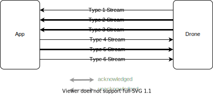
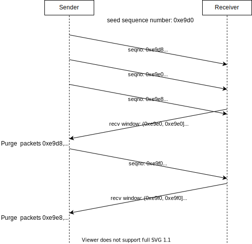
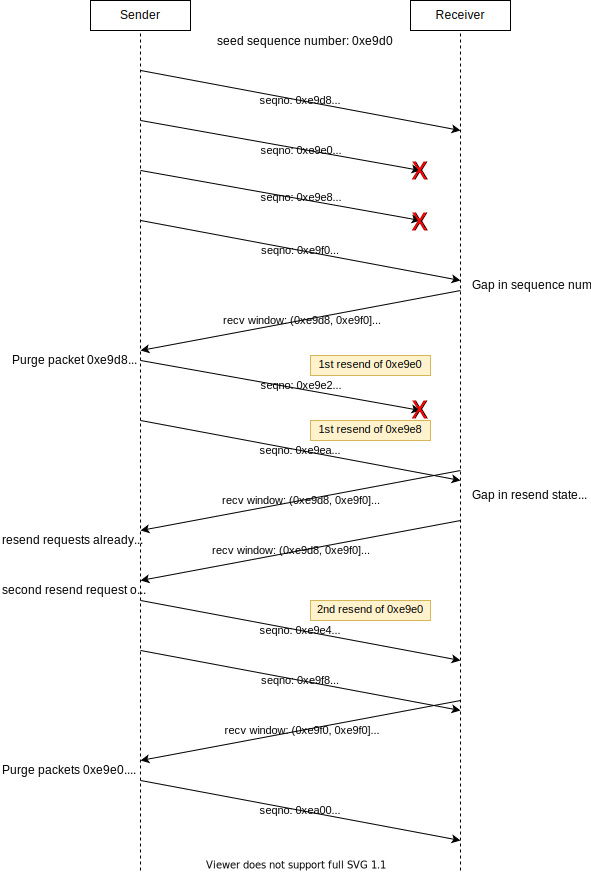

# DJI Proprietary UDP Protocol

This document talks about the proprietary UDP protocol which is used between the DJI Go 4 app and a Mavic Pro drone when the phone is connected to the drone directly via WiFi (without an intermediate remote control). It is likely that the same protocol is used on other DJI drones too.

Some general notes:
 - All communication takes place via UDP between 192.168.2.1:9003 (aircraft) and 192.168.2.20:12346 (phone).
 - All integer numbers are in little endian.
 - The protocol described here encapsulates another protocol which we call the "[DJI MB protocol](mb_protocol.md)" here. It is easily recognizable by the leading `0x55` in front of every chunk. The DJI MB protocol is used in many places (also drone internal communication) and it's the one that carries all the command and telemetry data except for the video feed.


## High level overview

After an initial handshake, three acknowledged packet streams are spawned. These are characterized by their packets containing sequence numbers. In addition there are unacknowledged packet types. All sequence numbers and receive/transmit window states are separate for each acknowledged stream.



## Header format

This format applies to all observed packets.

| offset        | description
|---------------|-------------
| 0x00 ... 0x01 | Bits 14:0: Packet length (equal to the length of the UDP payload). Bit 15: **unknown** (always 1).
| 0x02 ... 0x03 | Session ID. All subsequent packets of the same "connection" have the same value and it is different across reboots of the phone app.
| 0x04 ... 0x05 | Sequence number. Non-zero for packets of types 0x02, 0x03 and 0x05 (see packet type for details). Zero for all other types.
| 0x06          | Packet type (the values 0x00 ... 0x06 were observed)
| 0x07          | XOR of the first 7 bytes

The values above offset 0x07 are not generally protected by a checksum. At least I can modify bytes 0x08...0x09 in the handshake and the drone responds.

## Packet Type `0x00`

 - Direction: both
 - Purpose: Kicks off the connection
 - Has sequence number: no
 - Frequency: once in each direction per connection

This packet type appears only in the initial handshake message and its response.

| offset        | description
|---------------|-------------
| 0x08 ... 0x09 | Seed for the sequence numbers of type 0x02 and type 0x05 packets. Lower 3 bits should probably be 0b000.
| 0x10 ... end  | **unknown**

Sending the handshake packet alone is enough to make the drone start emitting video and data packets for approximately 460ms. If they don't get acknowledged, the drone will stop sending video packets after ~460ms and data packets a bit later.

Example handshake packet:
```
0000  30 80 3a dd 00 00 00 57  d0 e9 64 00 64 00 c0 05   0.:....W ..d.d...
0010  14 00 00 0a 00 64 00 64  00 c0 05 14 00 00 64 00   .....d.d ......d.
0020  14 00 64 00 c0 05 14 00  00 64 00 01 01 04 0a 02   ..d..... .d......
```

Drone's response to the handshake:
```
0000   08 80 3a dd 00 00 00 6f
```

## Packet Type `0x01`

 - Direction: drone to app
 - Purpose: Contains telemetry data encapsulated in the DJI MB protocol.
 - Has sequence number: yes
 - Frequency: 10Hz

| offset        | description
|---------------|-------------
| 0x08 ... 0x09 | type2 send window start
| 0x0a ... 0x0b | type2 send window end
| 0x0c ... 0x0d | type2 resend state 1
| 0x0e ... 0x0f | type2 resend state 2
| 0x10 ... 0x11 | type3 send window start
| 0x12 ... 0x13 | type3 send window end
| 0x14 ... 0x15 | type3 resend state 1 (presumably)
| 0x16 ... 0x17 | type3 resend state 2 (presumably)
| 0x18 ... 0x19 | type5 receive window start
| 0x1a ... 0x1b | type5 receive window end
| 0x1c ... X-1  | type5 resend request list (total length: 2+2*N, where N is the number of sequence numbers in the list)
| X    ... X+1  | total length of the remaining DJI MB Protocol payload
| X+2  ... end  | One or more DJI MB protocol chunks.

## Packet Type `0x02`

 - Direction: drone to app
 - Purpose: Contains the video feed. Video frames can be split across multiple packets but a packet never contains multiple frames.
 - Has sequence number: yes
 - Frequency: 30Hz

| offset        | description
|---------------|-------------
| 0x08 ... 0x09 | type2 send window start
| 0x0a ... 0x0b | type2 send window end
| 0x0c ... 0x0d | type2 resend state 1
| 0x0e ... 0x0f | type2 resend state 2
| 0x10          | frame number
| 0x11          | the MSB of this byte is the LSB of the "part number" (see below). The remaining 7 bits tell us the number of packets that this frame consists of.
| 0x12 ... 0x13 | "part number" within a single frame. The LSB of this value is in byte 0x11.
| 0x14 ... end  | H.264 video stream content

## Packet Type `0x03`

 - Direction: drone to app
 - Purpose: **unknown**
 - Has sequence number: yes
 - Frequency: Very rare (in 40s of logs only 3 of these packets were observed). This apparently needs to be triggered by the app since the drone does not send this packet in the minimal example.

| offset        | description
|---------------|-------------
| 0x08 ... 0x09 | type3 send window start
| 0x0a ... 0x0b | type3 send window end
| 0x0c ... 0x0d | type3 resend state 1
| 0x0e ... 0x0f | type3 resend state 2
| 0x10          | **unknown** (starts at 1 and increments by 1 for every packet of type `0x03`)
| 0x11 ... 0x13 | **unknown** (always "0x01 0x00 0x00" in my observations)
| 0x14 ... end  | DJI MB protocol payload (one long chunk)

## Packet Type `0x04`/`0x06`

 - Purpose: acknowledges packets from the drone
 - Direction: app to drone
 - Has sequence number: no
 - Frequency: 30Hz (type 4) and 60Hz (type 6)

It seems like type 4 is always used to acknowledges end-of-frame packets (*TODO: verify*). Type 6 possibly acknowledges both the first packet of a frame and the last packet of a frame.

| offset        | description
|---------------|-------------
| 0x08 ... 0x09 | type2 receive window start
| 0x0a ... 0x0b | type2 receive window end
| 0x0c ... X-1  | type2 resend request list (total length: 2+2*N, where N is the number of sequence numbers in the list)
| X    ... X+1  | type3 receive window start
| X+2  ... X+3  | type3 receive window end
| X+4  ... Y-1  | type3 resend request list (total length: 2+2*N, where N is the number of sequence numbers in the list)
| Y    ... Y+1  | type5 send window start
| Y+2  ... Y+3  | type5 send window end
| Y+4  ... Y+5  | type5 resend state 1
| Y+6  ... Y+7  | type5 resend state 2
| Y+8  ... Y+9  | length of the remaining DJI MB protocol payload
| Y+10 ... end  | DJI MB protocol payload (here I only observed MB packets going from "0x02" (App) to "0x09" (HD transmission RC side). Either zero, one or two of these packets were present.)

## Packet Type `0x05`

 - Purpose: contains command data encapsulated in the DJI MB protocol
 - Direction: app to drone
 - Has sequence number: yes
 - Frequency: approx 27Hz (log0) or 20Hz (log1)

| offset        | description
|---------------|-------------
| 0x08 ... 0x09 | type5 send window start
| 0x0a ... 0x0b | type5 send window end
| 0x0c ... 0x0d | type5 resend state 1
| 0x0e ... 0x0f | type5 resend state 2
| 0x10          | **unknown** (increments by 1 for every packet of type `0x05`)
| 0x11 ... 0x13 | **unknown** (always "0x01 0x00 0x00" in my observations)
| 0x14 ... end  | DJI MB protocol payload


## Flow Control

This section describes how the acknowledged streams work.

 - Send window start: This is the highest sequence number that the sender has no longer cached for retransmission. It is bumped based on the receive window.
 - Send window end: This is the highest sequence number that the sender has cached for retransmission if requested by the receiver.
 - Resend state 1: Indicates the largest sequence number (with the 3 LSBs set to 0b001) that was resent at least once but not yet acknowledged by the receiver. If there are no sequence numbers matching this description, this field is 0.
 - Resend state 2: Same as resend state 1 except that it pretains to packets that were resent at least twice.

### Normal Operation



### Packet Loss



Comments:

 - Retransmissions must be requested in the order that the gaps occur. E.g. if the resend request list starts with a sequence number that is not equal to the first non-acknowledged packet, the whole resend request list is ignored.
 - Even though it is possible to request a third resend it seems to be impossible for a receiver to detect the loss of a second resend.


**TODO** look into timeout/restart behavior. What does the app send if it receives no more messages and when?

